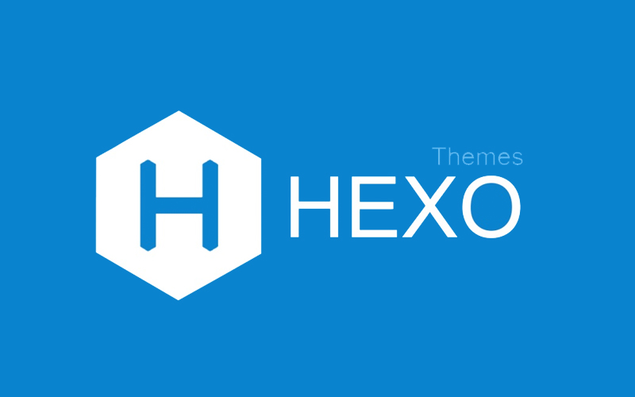

    

# hexo themes sort 

> A list of hexo themes, sorted by stars.

## Content

| Name  | Description | Star  |
| ---- | ---- | ---- |
| [iissnan/hexo-theme-next](https://www.github.com/iissnan/hexo-theme-next) | Elegant theme for Hexo. |  |
| [litten/hexo-theme-yilia](https://www.github.com/litten/hexo-theme-yilia) | 一个简洁优雅的hexo主题 A simple and elegant theme for hexo. |  |
| [theme-next/hexo-theme-next](https://www.github.com/theme-next/hexo-theme-next) | Elegant and powerful theme for Hexo. |  |
| [ppoffice/hexo-theme-icarus](https://www.github.com/ppoffice/hexo-theme-icarus) | A simple, delicate, and modern theme for the static site generator Hexo. |  |
| [viosey/hexo-theme-material](https://www.github.com/viosey/hexo-theme-material) | Material Design theme for hexo. |  |
| [blinkfox/hexo-theme-matery](https://www.github.com/blinkfox/hexo-theme-matery) | A beautiful hexo blog theme with material design and responsive design.一个基于材料设计和响应式设计而成的全面、美观的Hexo主题。国内访问：http://blinkfox.com/ |  |
| [yscoder/hexo-theme-indigo](https://www.github.com/yscoder/hexo-theme-indigo) | 一个Material Design风格的Hexo主题。 https://imys.net/ |  |
| [fluid-dev/hexo-theme-fluid](https://www.github.com/fluid-dev/hexo-theme-fluid) | 🌊 一款 Material Design 风格的 Hexo 主题 / An elegant Material-Design theme for Hexo |  |
| [probberechts/hexo-theme-cactus](https://www.github.com/probberechts/hexo-theme-cactus) | 🌵 A responsive, clean and simple theme for Hexo. |  |
| [pinggod/hexo-theme-apollo](https://www.github.com/pinggod/hexo-theme-apollo) | 🌅 a concise hexo theme |  |
| [jerryc127/hexo-theme-butterfly](https://www.github.com/jerryc127/hexo-theme-butterfly) | 🦋 A Hexo Theme: Butterfly |  |
| [LouisBarranqueiro/hexo-theme-tranquilpeak](https://www.github.com/LouisBarranqueiro/hexo-theme-tranquilpeak) | 💄 A gorgeous responsive theme for Hexo blog framework |  |
| [Molunerfinn/hexo-theme-melody](https://www.github.com/Molunerfinn/hexo-theme-melody) | 🎹A simple & beautiful & fast theme for Hexo. |  |
| [ahonn/hexo-theme-even](https://www.github.com/ahonn/hexo-theme-even) | 🚀 A super concise theme for Hexo |  |
| [fi3ework/hexo-theme-archer](https://www.github.com/fi3ework/hexo-theme-archer) | 🏹 A smart and modern theme for Hexo. |  |
| [ppoffice/hexo-theme-hueman](https://www.github.com/ppoffice/hexo-theme-hueman) | A redesign of Alx's wordpress theme Hueman, ported to Hexo. |  |
| [forsigner/fexo](https://www.github.com/forsigner/fexo) | A minimalist design theme for hexo. |  |
| [wuchong/jacman](https://www.github.com/wuchong/jacman) | Jacman is a fresh looking and responsive theme for Hexo with more features based on Pacman. |  |
| [shenliyang/hexo-theme-snippet](https://www.github.com/shenliyang/hexo-theme-snippet) | Snippet 简洁而不简单，也许是一款你寻找已久的hexo主题 |  |
| [volantis-x/hexo-theme-volantis](https://www.github.com/volantis-x/hexo-theme-volantis) | A Wonderful Theme for Hexo https://volantis.js.org |  |
| [Fechin/hexo-theme-diaspora](https://www.github.com/Fechin/hexo-theme-diaspora) | Hexo theme, Blog theme, Clean, Responsive theme |  |
| [Haojen/hexo-theme-Anisina](https://www.github.com/Haojen/hexo-theme-Anisina) | 🎨 A simple responsive , support qiniu image cdn theme for hexo https://haojen.github.io/ |  |
| [Shen-Yu/hexo-theme-ayer](https://www.github.com/Shen-Yu/hexo-theme-ayer) | a clean and elegant theme for Hexo. 🐋 |  |
| [cofess/hexo-theme-pure](https://www.github.com/cofess/hexo-theme-pure) | Hexo theme pure. It's a pure theme for Hexo. |  |
| [theme-nexmoe/hexo-theme-nexmoe](https://www.github.com/theme-nexmoe/hexo-theme-nexmoe) | 🔥 一个比较特别的 Hexo 主题 |  |
| [luuman/hexo-theme-spfk](https://www.github.com/luuman/hexo-theme-spfk) | Hexo双栏博客主题仓库 Another simple and elegant theme for Hexo. |  |
| [next-theme/hexo-theme-next](https://www.github.com/next-theme/hexo-theme-next) | 🎉 Elegant and powerful theme for Hexo. |  |
| [Kaijun/hexo-theme-huxblog](https://www.github.com/Kaijun/hexo-theme-huxblog) | 🚙 Ported Theme of Hux Blog |  |
| [ppoffice/hexo-theme-minos](https://www.github.com/ppoffice/hexo-theme-minos) | A simple and retro styled Hexo theme, concentrated more on your ideas. |  |
| [SuperKieran/TKL](https://www.github.com/SuperKieran/TKL) | Hexo Theme |  |
| [A-limon/pacman](https://www.github.com/A-limon/pacman) | Pacman is a flat and responsive design theme for Hexo. |  |
| [Ben02/hexo-theme-Anatole](https://www.github.com/Ben02/hexo-theme-Anatole) | A white and simple Hexo theme, originated from a Farbox theme |  |
| [yanm1ng/hexo-theme-vexo](https://www.github.com/yanm1ng/hexo-theme-vexo) | 🍟 Vexo is a Hexo theme inspired by Vue's official website. |  |
| [zthxxx/hexo-theme-Wikitten](https://www.github.com/zthxxx/hexo-theme-Wikitten) | A theme of Hexo for personal wiki which seems like Wikitten style. |  |
| [EYHN/hexo-theme-one](https://www.github.com/EYHN/hexo-theme-one) | hexo单页面炫酷主题 |  |
| [xiangming/landscape-plus](https://www.github.com/xiangming/landscape-plus) | 针对中国大陆地区对hexo官方主题landscape进行优化。 |  |
| [letiantian/huno](https://www.github.com/letiantian/huno) | A responsible theme for Hexo |  |
| [CodeDaraW/Hacker](https://www.github.com/CodeDaraW/Hacker) | ❤️ A simple theme for Hexo |  |
| [Mrminfive/hexo-theme-skapp](https://www.github.com/Mrminfive/hexo-theme-skapp) | The hexo flat design theme(扁平化简约主题) |  |
| [Siricee/hexo-theme-Chic](https://www.github.com/Siricee/hexo-theme-Chic) | An elegant, powerful, easy-to-read Hexo theme. |  |
| [sabrinaluo/hexo-theme-replica](https://www.github.com/sabrinaluo/hexo-theme-replica) | Github style replication for hexo theme |  |
| [SukkaW/hexo-theme-suka](https://www.github.com/SukkaW/hexo-theme-suka) | 🎨Modern, powerful and simple theme for Hexo. |  |
| [raytaylorlin/hexo-theme-raytaylorism](https://www.github.com/raytaylorlin/hexo-theme-raytaylorism) | 一款Material Design风格的hexo主题 |  |
| [hexojs/awesome-hexo](https://www.github.com/hexojs/awesome-hexo) | A curated list of awesome things related to Hexo |  |
| [DIYgod/hexo-theme-sagiri](https://www.github.com/DIYgod/hexo-theme-sagiri) | 🍰 As lovely as sagiri |  |
| [ikeq/hexo-theme-inside](https://www.github.com/ikeq/hexo-theme-inside) | ❤️ SPA, Flat and clean theme for Hexo. https://blog.oniuo.com/theme-inside/ |  |
| [JoeyBling/hexo-theme-yilia-plus](https://www.github.com/JoeyBling/hexo-theme-yilia-plus) | 一个简洁优雅的hexo主题 A simple and elegant theme for hexo. |  |
| [YenYuHsuan/hexo-theme-beantech](https://www.github.com/YenYuHsuan/hexo-theme-beantech) | ✨ Ported theme of Hux Blog by Kaijun, Modified by YuHsuan ✨ |  |
| [TriDiamond/hexo-theme-obsidian](https://www.github.com/TriDiamond/hexo-theme-obsidian) | 🎨 A dark Hexo theme, it's responsive, simple but elegant. |  |
| [yelog/hexo-theme-3-hexo](https://www.github.com/yelog/hexo-theme-3-hexo) | hexo主题：三段式设计、极简、方便 Hexo theme: three-stage design |  |
| [aircloud/hexo-theme-aircloud](https://www.github.com/aircloud/hexo-theme-aircloud) | A concise hexo theme |  |
| [YunYouJun/hexo-theme-yun](https://www.github.com/YunYouJun/hexo-theme-yun) | ☁️ A fast & light & lovely theme for Hexo. 一个对可爱自以为是的 Hexo 主题。 |  |
| [Sariay/hexo-theme-Annie](https://www.github.com/Sariay/hexo-theme-Annie) | Simple blog theme for Hexo. |  |
| [dongyuanxin/theme-bmw](https://www.github.com/dongyuanxin/theme-bmw) | ✋ Smart Voice: Voice for yourself  |  |
| [wzpan/hexo-theme-freemind](https://www.github.com/wzpan/hexo-theme-freemind) | Most powerful bootstrap theme for hexo. |  |
| [zhwangart/hexo-theme-ocean](https://www.github.com/zhwangart/hexo-theme-ocean) | Ocean is a mobile-enabled Hexo theme based on the features in Hexo's default theme landscape. |  |
| [klugjo/hexo-theme-clean-blog](https://www.github.com/klugjo/hexo-theme-clean-blog) | Hexo implementation of Clean Blog http://blackrockdigital.github.io/startbootstrap-clean-blog/index.html |  |
| [SumiMakito/hexo-theme-typography](https://www.github.com/SumiMakito/hexo-theme-typography) | Rediscover the beauty of typography. |  |
| [iTimeTraveler/hexo-theme-hiker](https://www.github.com/iTimeTraveler/hexo-theme-hiker) | An attractive theme for Hexo. called "Hiker", short for "HikerNews". |  |
| [miccall/hexo-theme-Mic_Theme](https://www.github.com/miccall/hexo-theme-Mic_Theme) | hexo theme |  |
| [chaooo/hexo-theme-BlueLake](https://www.github.com/chaooo/hexo-theme-BlueLake) | A simple theme for Hexo with great performance on different devices . |  |
| [godweiyang/hexo-matery-modified](https://www.github.com/godweiyang/hexo-matery-modified) | My personal modified hexo matery theme with some bugs fixed. |  |
| [EasyHexo/Easy-Hexo](https://www.github.com/EasyHexo/Easy-Hexo) | 🤘 Build your own website with Hexo, the easy way. 轻松使用 Hexo 建站。 |  |
| [hexojs/hexo-theme-light](https://www.github.com/hexojs/hexo-theme-light) | A simple theme for Hexo |  |
| [frostfan/hexo-theme-polarbear](https://www.github.com/frostfan/hexo-theme-polarbear) | A super light and simple theme. |  |
| [ZEROKISEKI/hexo-theme-gal](https://www.github.com/ZEROKISEKI/hexo-theme-gal) | 忧郁的弟弟网站主题移植 |  |
| [XPoet/hexo-theme-keep](https://www.github.com/XPoet/hexo-theme-keep) | 🌈 A simple and elegant theme for Hexo. It makes you more focused on writing. |  |
| [sharvaridesai/hexo-theme-edinburgh](https://www.github.com/sharvaridesai/hexo-theme-edinburgh) | Beautiful minimal portfolio theme for Hexo. |  |
| [mythsman/hexo-douban](https://www.github.com/mythsman/hexo-douban) | 💿 A simple plugin for hexo that helps us generate pages for douban books ,movies and games. |  |
| [klugjo/hexo-theme-alpha-dust](https://www.github.com/klugjo/hexo-theme-alpha-dust) | 🌠 Original Futuristic Hexo Theme |  |
| [huweihuang/hexo-theme-huweihuang](https://www.github.com/huweihuang/hexo-theme-huweihuang) | Ported theme of Hux Blog by YuHsuan, Modified by Hu Weihuang |  |
| [Haojen/hexo-theme-Claudia](https://www.github.com/Haojen/hexo-theme-Claudia) | 🔥 Claudia is a Hexo theme, Simple / Grace / and Support Emoji, and More |  |
| [dongyuanxin/theme-ad](https://www.github.com/dongyuanxin/theme-ad) | 🔨 Art design theme for write and show. |  |
| [stkevintan/hexo-theme-material-flow](https://www.github.com/stkevintan/hexo-theme-material-flow) | Yet Another Material-Design-Style Hexo Theme |  |
| [Tomotoes/hexo-theme-tomotoes](https://www.github.com/Tomotoes/hexo-theme-tomotoes) | 🍅 A fresh and refined Hexo theme |  |
| [geekplux/hexo-theme-typing](https://www.github.com/geekplux/hexo-theme-typing) | a pure and fresh Hexo theme. 🎹 |  |
| [monniya/hexo-theme-new-vno](https://www.github.com/monniya/hexo-theme-new-vno) | The new Vno theme ported to Hexo http://monniya.com |  |
| [liuyib/hexo-theme-stun](https://www.github.com/liuyib/hexo-theme-stun) | 🦄 An elegant theme for Hexo |  |
| [GallenHu/hexo-theme-Daily](https://www.github.com/GallenHu/hexo-theme-Daily) | A simple theme for Hexo |  |
| [hexojs/hexo-theme-landscape](https://www.github.com/hexojs/hexo-theme-landscape) | A brand new default theme for Hexo. |  |
| [yuche/hexo-theme-kael](https://www.github.com/yuche/hexo-theme-kael) | [DEPRECATED] A Clean design theme with Inline comment and Multi-level-push-menu.Demo: |  |
| [sanjinhub/hexo-theme-geek](https://www.github.com/sanjinhub/hexo-theme-geek) | 一个符合极客精神主义极简的 Hexo 主题 |  |
| [zalando-incubator/hexo-theme-doc](https://www.github.com/zalando-incubator/hexo-theme-doc) | A documentation theme for the Hexo blog framework |  |
| [digitalcraftsman/hugo-icarus-theme](https://www.github.com/digitalcraftsman/hugo-icarus-theme) | Port of Ruipeng Zhang's Hexo theme Icarus to Hugo. |  |
| [klugjo/hexo-theme-phantom](https://www.github.com/klugjo/hexo-theme-phantom) | Hexo implementation of Phantom (http://html5up.net/phantom) |  |
| [tangkunyin/hexo-theme-jsimple](https://www.github.com/tangkunyin/hexo-theme-jsimple) | Simple three columns theme for Hexo.Inspired by JianShu.com |  |
| [giscafer/hexo-theme-cafe](https://www.github.com/giscafer/hexo-theme-cafe) | 精简的Hexo博客主题，样式风格如阮一峰老师博客 |  |
| [iTimeTraveler/hexo-theme-hiero](https://www.github.com/iTimeTraveler/hexo-theme-hiero) | An awesome magazine, blog theme for your Hexo site. |  |
| [colmugx/hexo-theme-Nlvi](https://www.github.com/colmugx/hexo-theme-Nlvi) | 🎨A simple theme for hexo. |  |
| [SumiMakito/hexo-theme-Journal](https://www.github.com/SumiMakito/hexo-theme-Journal) | 隻言片語・於此匯聚 – Moments piled up. Live demo → |  |
| [hsxyhao/gridea-theme-next](https://www.github.com/hsxyhao/gridea-theme-next) | Gridea NexT主题，搬hexo-next-theme |  |
| [iTimeTraveler/hexo-theme-hipaper](https://www.github.com/iTimeTraveler/hexo-theme-hipaper) | A fashional newspaper theme for Hexo. |  |
| [ochukai/hexo-theme-ochuunn](https://www.github.com/ochukai/hexo-theme-ochuunn) | A simple green super hexo theme. |  |
| [WongMinHo/hexo-theme-miho](https://www.github.com/WongMinHo/hexo-theme-miho) | 🍺一款单栏响应式的hexo主题, A single column response for hexo . https://blog.minhow.com |  |
| [boizz/hexo-theme-laughing](https://www.github.com/boizz/hexo-theme-laughing) | A lightweight hexo theme |  |
| [gaoryrt/hexo-theme-pln](https://www.github.com/gaoryrt/hexo-theme-pln) | 📝 Plain theme for Hexo. |  |
| [stiekel/hexo-theme-random](https://www.github.com/stiekel/hexo-theme-random) | A hexo theme with random fullscreen background image. |  |
| [Lemonreds/hexo-theme-nayo](https://www.github.com/Lemonreds/hexo-theme-nayo) | 一个简洁的Hexo主题. |  |
| [ptsteadman/hexo-theme-corporate](https://www.github.com/ptsteadman/hexo-theme-corporate) | A professional Hexo theme based on Metronic's "Corporate Frontend" framework. |  |
| [heroicyang/hexo-theme-modernist](https://www.github.com/heroicyang/hexo-theme-modernist) | Theme for Hexo. Based on modernist theme for GitHub Pages. |  |
| [esappear/hexo-theme-clover](https://www.github.com/esappear/hexo-theme-clover) | Clover theme for Hexo. |  |
| [ShanaMaid/hexo-theme-shana](https://www.github.com/ShanaMaid/hexo-theme-shana) | what's a cool hexo theme! |  |
| [artchen/hexo-theme-memory](https://www.github.com/artchen/hexo-theme-memory) | A minimal hexo theme. |  |
| [zchen9/hexo-theme-hollow](https://www.github.com/zchen9/hexo-theme-hollow) | A pure and elegant theme for Hexo. |  |
| [geektutu/hexo-theme-geektutu](https://www.github.com/geektutu/hexo-theme-geektutu) | 极速加载的Hexo主题，不引入第三方JS库 |  |
| [lazysheep666/terminal_theme](https://www.github.com/lazysheep666/terminal_theme) | A simple theme based on hexo 👻👻👻 |  |
| [justpsvm/hexo-theme-varaint](https://www.github.com/justpsvm/hexo-theme-varaint) | varaint for Hexo |  |
| [kevinma2010/hexo-theme-vno](https://www.github.com/kevinma2010/hexo-theme-vno) | The Ghost Vno theme ported to Hexo |  |
| [kaiiiz/hexo-theme-book](https://www.github.com/kaiiiz/hexo-theme-book) | A simple, elegant, book-like hexo theme with some useful features. |  |
| [lewis-geek/hexo-theme-Aath](https://www.github.com/lewis-geek/hexo-theme-Aath) | Hexo 主题 |  |
| [codefine/hexo-theme-mellow](https://www.github.com/codefine/hexo-theme-mellow) | based on material design |  |
| [kywk/hexo-theme-casper](https://www.github.com/kywk/hexo-theme-casper) | Ghost Casper hexo port |  |
| [klugjo/hexo-theme-magnetic](https://www.github.com/klugjo/hexo-theme-magnetic) | Adaptation of http://pixelhint.com/magnetic-free-html5-responsive-photography-website-template/ for hexo |  |
| [denjones/hexo-theme-chan](https://www.github.com/denjones/hexo-theme-chan) | A super simple and elegant theme for hexo |  |
| [AlynxZhou/hexo-theme-aria](https://www.github.com/AlynxZhou/hexo-theme-aria) | A Hexo theme inspired by Kalafina's song ARIA. |  |
| [HeskeyBaozi/hexo-theme-lite](https://www.github.com/HeskeyBaozi/hexo-theme-lite) | Keep Calm, Light and Writing. Light Hexo Theme. |  |
| [maochunguang/black-blue](https://www.github.com/maochunguang/black-blue) | a black theme of hexo |  |
| [KevinOfNeu/hexo-theme-xoxo](https://www.github.com/KevinOfNeu/hexo-theme-xoxo) | Hexo theme for https://blog.0xff000000.com |  |
| [ChrAlpha/hexo-theme-cards](https://www.github.com/ChrAlpha/hexo-theme-cards) | Another Simple & Swift theme for Hexo |  |
| [wzpan/hexo-theme-wixo](https://www.github.com/wzpan/hexo-theme-wixo) | A wiki theme for Hexo. |  |
| [sanonz/hexo-theme-concise](https://www.github.com/sanonz/hexo-theme-concise) | Hexo 简约主题，响应式设计支持 PC、平板、手机等设备，代码高亮使用 monokai-sublime 风格，支持亮/暗色主题跟随系统。可以最低兼容到 IE8。 |  |
| [klugjo/hexo-theme-anodyne](https://www.github.com/klugjo/hexo-theme-anodyne) | 🌋 Original Bright Theme for Hexo |  |
| [HyunSeob/hexo-theme-overdose](https://www.github.com/HyunSeob/hexo-theme-overdose) | ⚠ Caution: you could be overdosed with this theme. |  |
| [blleng/hexo-theme-lx](https://www.github.com/blleng/hexo-theme-lx) | 👉 A simple & clear & elegant Hexo theme. 🔭🔭Lx——一款简洁、美观的Hexo博客主题。 |  |
| [smackgg/hexo-theme-smackdown](https://www.github.com/smackgg/hexo-theme-smackdown) | hexo-theme-smackdown DEMO: |  |
| [moumao/hexo-theme-Vateral](https://www.github.com/moumao/hexo-theme-Vateral) | 😘hexo单页面主题：Vateral（a theme for hexo） |  |
| [xrr2016/hexo-theme-cold-stone](https://www.github.com/xrr2016/hexo-theme-cold-stone) | A simple, refreshing, text-based Hexo blog theme. |  |
| [lotabout/very-simple](https://www.github.com/lotabout/very-simple) | A very simple theme for hexo |  |
| [removeif/hexo-theme-amazing](https://www.github.com/removeif/hexo-theme-amazing) | Demo: https://removeif.github.io/removeif-demo hexo-theme |  |
| [random-yang/paper](https://www.github.com/random-yang/paper) | 🌈 一个类纸风的主题paper🎉(still updating...) |  |
| [xzhih/hexo-theme-casper](https://www.github.com/xzhih/hexo-theme-casper) | New casper theme ported to hexo. |  |
| [fan-lv/Fan](https://www.github.com/fan-lv/Fan) | hexo-theme |  |
| [AmazingRise/hugo-theme-diary](https://www.github.com/AmazingRise/hugo-theme-diary) | Moments piled up. A Hugo theme ported from SumiMakito/hexo-theme-Journal. |  |
| [xtfly/hugo-theme-next](https://www.github.com/xtfly/hugo-theme-next) | This is a hugo theme forked from hexo-theme-next |  |
| [miiiku/flex-block](https://www.github.com/miiiku/flex-block) | 一个基于Hexo的主题 |  |
| [17/hexo-theme-strict](https://www.github.com/17/hexo-theme-strict) | A clean, minimal and responsive theme for hexo |  |
| [mickeyouyou/yinwang](https://www.github.com/mickeyouyou/yinwang) | Blog Theme For Hexo |  |
| [justpsvm/hexo-theme-primer](https://www.github.com/justpsvm/hexo-theme-primer) | The github style (primer) for Hexo theme. |  |
| [Longlongyu/hexo-theme-Cxo](https://www.github.com/Longlongyu/hexo-theme-Cxo) | A cool ，simple & beautiful theme for Hexo. 🍄 |  |
| [Yue-plus/hexo-theme-arknights](https://www.github.com/Yue-plus/hexo-theme-arknights) | 明日方舟罗德岛阵营的 Hexo 主题，支持数学公式、Valine评论系统、Mermaid图表 |  |
| [carsonip/hugo-theme-minos](https://www.github.com/carsonip/hugo-theme-minos) | A simple and retro styled Hugo theme ported from Hexo |  |
| [GeekaholicLin/hexo-theme-ylion](https://www.github.com/GeekaholicLin/hexo-theme-ylion) | 😊 说不定是一个让你感到惊喜的hexo主题 🍻 🍬 |  |
| [neoFelhz/hexo-theme-spectre](https://www.github.com/neoFelhz/hexo-theme-spectre) | A modern, simple & elegant theme for Hexo |  |
| [jangdelong/hexo-theme-xups](https://www.github.com/jangdelong/hexo-theme-xups) | hexo主题xups |  |
| [coneycode/coney](https://www.github.com/coneycode/coney) | my theme for hexo named coney |  |
| [wizardforcel/hexo-theme-cyanstyle](https://www.github.com/wizardforcel/hexo-theme-cyanstyle) | Hexo 主题 湖绿风 |  |
| [lyyourc/hexo-theme-again](https://www.github.com/lyyourc/hexo-theme-again) | lalala |  |
| [pinggod/hexo-theme-jekyll](https://www.github.com/pinggod/hexo-theme-jekyll) | a hexo theme inspired by jekyllrb.com |  |
| [izhaoo/hexo-theme-zhaoo](https://www.github.com/izhaoo/hexo-theme-zhaoo) | 🐳 A simple theme for Hexo |  |
| [sjaakvandenberg/flexy](https://www.github.com/sjaakvandenberg/flexy) | A responsive theme for Hexo |  |
| [yiluyanxia/hexo-theme-antiquity](https://www.github.com/yiluyanxia/hexo-theme-antiquity) | 一个有点古风的Hexo主题，来自一个不会设计不会配色的前端渣渣。点击这里预览--> |  |
| [Bulandent/hexo-theme-bubuzou](https://www.github.com/Bulandent/hexo-theme-bubuzou) | 一个仿Vue官网风格的hexo主题 https://bubuzou.com/ |  |
| [hejianxian/hexo-theme-jane](https://www.github.com/hejianxian/hexo-theme-jane) | 🎨 Simple enough, a hexo theme. |  |
| [wayou/hexo-theme-material](https://www.github.com/wayou/hexo-theme-material) | a theme of hexo using the material design bootstrap |  |
| [icylogic/maupassant-hexo](https://www.github.com/tufu9441/maupassant-hexo) | A simple hexo theme forked from pagecho/maupassant |  |
| [nameoverflow/hexo-theme-icalm](https://www.github.com/nameoverflow/hexo-theme-icalm) | Monochrome theme for hexo |  |
| [hexojs/hexo-theme-phase](https://www.github.com/hexojs/hexo-theme-phase) | Feel the flow of time with Phase, the most beautiful theme for Hexo. |  |
| [artchen/hexo-theme-element](https://www.github.com/artchen/hexo-theme-element) | A minimal Hexo theme. |  |
| [glazec/hexo-cheatsheets](https://www.github.com/glazec/hexo-cheatsheets) | a cheatsheets theme for hexo |  |
| [FrontendSophie/hexo-theme-autumn](https://www.github.com/FrontendSophie/hexo-theme-autumn) | 🍊A salute to the classic. |  |
| [amehime/hexo-theme-shoka](https://www.github.com/amehime/hexo-theme-shoka) | Just For https://shoka.lostyu.me/ |  |
| [BillChen2K/typora-theme-next](https://www.github.com/BillChen2K/typora-theme-next) | A theme for Typora, inspired by hexo theme NexT. |  |
| [th720309/hexo-theme-believe](https://www.github.com/th720309/hexo-theme-believe) | A simple theme for hexo Sample: |  |
| [moretwo/hexo-theme](https://www.github.com/moretwo/hexo-theme) | mabao-theme hexo |  |
| [SukkaW/hexo-theme-doku](https://www.github.com/SukkaW/hexo-theme-doku) | 📜 Doku, a Hexo theme designed for writing documents. |  |
| [TongchengQiu/hexo-theme-another](https://www.github.com/TongchengQiu/hexo-theme-another) | 🌱🌱🌱a pithy theme of hexo. |  |
| [shixiaohu2206/hexo-theme-huhu](https://www.github.com/shixiaohu2206/hexo-theme-huhu) | theme for hexo |  |
| [sqlsec/Django-Hexo-Matery](https://www.github.com/sqlsec/Django-Hexo-Matery) | 尝试用Django3重写的我的Hexo博客，使用的前端主题是 Matery。 |  |
| [lotabout/hexo-theme-noise](https://www.github.com/lotabout/hexo-theme-noise) | A hexo theme |  |
| [leafjame/hexo-theme-next5-leaf](https://www.github.com/leafjame/hexo-theme-next5-leaf) | 一款基于 Hexo v3.9 & Next v5.1.4 魔改的主题 🌞 |  |
| [HoverBaum/meilidu-hexo](https://www.github.com/HoverBaum/meilidu-hexo) | MeiliDu, beatuiful reading theme for Hexo. |  |
| [FuShaoLei/hexo-theme-white](https://www.github.com/FuShaoLei/hexo-theme-white) | 一款在极简和个性之间徘徊的Hexo主题 |  |
| [qutang/hexo-theme-cutie](https://www.github.com/qutang/hexo-theme-cutie) | A hexo theme called cutie |  |
| [lh1me/hexo-theme-aomori](https://www.github.com/lh1me/hexo-theme-aomori) | A Hexo Theme. Hexo 博客主题 |  |
| [idhyt/hexo-theme-next](https://www.github.com/idhyt/hexo-theme-next) | Mala theme is modify base on iissnan/hexo-theme-next |  |
| [hexojs/hexo-theme-unit-test](https://www.github.com/hexojs/hexo-theme-unit-test) | This is a dummy Hexo site for theme unit test. You should test your theme before release. |  |
| [sun11/hexo-theme-paperbox](https://www.github.com/sun11/hexo-theme-paperbox) | A responsive paper-like theme for hexo blog. |  |
| [gary-Shen/hexo-theme-bear](https://www.github.com/gary-Shen/hexo-theme-bear) | Hexo theme base on Bear 🐻. |  |
| [huyingjie/hexo-theme-A-RSnippet](https://www.github.com/huyingjie/hexo-theme-A-RSnippet) | 🦀 A Responsive Theme for Hexo 🦀 |  |
| [pengloo53/Hexo-theme-light_cn](https://www.github.com/pengloo53/Hexo-theme-light_cn) | The Hexo theme base on hexo-theme-light, Write a little book about hexo. |  |
| [tiaanduplessis/hexo-theme-brewski](https://www.github.com/tiaanduplessis/hexo-theme-brewski) | A minimal Hexo theme |  |
| [XadillaX/hexadillax](https://www.github.com/XadillaX/hexadillax) | A hexo blogging system theme. |  |
| [henryhuang/hexo-theme-aloha](https://www.github.com/henryhuang/hexo-theme-aloha) | A hexo theme, use semantic ui. |  |
| [Sunnyyoung/Farbox-NexT](https://www.github.com/Sunnyyoung/Farbox-NexT) | A hexo theme NexT for Farbox. |  |
| [chunqiuyiyu/hexo-theme-polk](https://www.github.com/chunqiuyiyu/hexo-theme-polk) | Simple blog theme for Hexo, focusing on articles. |  |
| [NoahDragon/hexo-theme-react](https://www.github.com/NoahDragon/hexo-theme-react) | Hexo migration of React theme. http://react.pimmey.com/ |  |
| [AngryPowman/hexo-theme-prontera](https://www.github.com/AngryPowman/hexo-theme-prontera) | A light theme for Hexo: http://powman.org |  |
| [meteor/meteor-theme-hexo](https://www.github.com/meteor/meteor-theme-hexo) | The framework we use for docs. |  |
| [dusign/hexo-theme-snail](https://www.github.com/dusign/hexo-theme-snail) | This is a hexo theme |  |
| [jysperm/hexo-theme-simpleblock](https://www.github.com/jysperm/hexo-theme-simpleblock) | Hexo theme of jysperm's blog. |  |
| [zongren/font](https://www.github.com/zongren/font) | 用于个人博客所用的中文字体 |  |
| [henryhuang/oishi](https://www.github.com/henryhuang/oishi) | A Hexo theme |  |
| [xaoxuu/hexo-theme-resume](https://www.github.com/xaoxuu/hexo-theme-resume) | A Resume Theme for Hexo. 一个简洁的在线简历主题 https://resume.js.org |  |
| [HCLonely/hexo-theme-webstack](https://www.github.com/HCLonely/hexo-theme-webstack) | A hexo theme based on webstack. 一个基于webstack的hexo主题。 |  |
| [iJinxin/hexo-theme-sky](https://www.github.com/iJinxin/hexo-theme-sky) | a concise theme for hexo https://ijinxin.github.io/ |  |
| [Sanarous/hexo-theme-next5-polished](https://www.github.com/Sanarous/hexo-theme-next5-polished) | 🌥️基于Next5主题美化的一款hexo博客主题 |  |
| [xwartz/hexo-theme-nuna](https://www.github.com/xwartz/hexo-theme-nuna) | 🌱 Yet another hexo theme. |  |
| [zchengsite/hexo-theme-oranges](https://www.github.com/zchengsite/hexo-theme-oranges) | 🍊A simple hexo-theme of minimalism |  |
| [Xunzhuo/Coder](https://www.github.com/Xunzhuo/Coder) | A fast、pure、practical、elegant Hexo theme for Developers🔥🔥🔥 |  |
| [removeif/hexo-theme-icarus-removeif](https://www.github.com/removeif/hexo-theme-icarus-removeif) | Blog：https://removeif.github.io source code, modify from hexo-theme-icarus, simple and practical. Archieved ! |  |
| [chenall/hexo-theme-chenall](https://www.github.com/chenall/hexo-theme-chenall) | 一个模块化的hexo主题, |  |
| [twoyao/beautiful-hexo](https://www.github.com/twoyao/beautiful-hexo) | hexo theme ported from beautiful-jekyll. |  |
| [PhosphorW/hexo-theme-academia](https://www.github.com/PhosphorW/hexo-theme-academia) | A light & simple & responsive page for academic websites on Hexo, crafted from academicpages on Jekyll. |  |
| [ken8203/hexo-theme-alberta](https://www.github.com/ken8203/hexo-theme-alberta) | A simple, textured and responsive theme with your own photo. |  |
| [littlewin-wang/hexo-theme-casual](https://www.github.com/littlewin-wang/hexo-theme-casual) | ✨ 简约大气的hexo博客主题 |  |
| [ZEROKISEKI/hexo-theme-cube](https://www.github.com/ZEROKISEKI/hexo-theme-cube) | a theme for hexo |  |
| [heruoxin/hexo-persona-color](https://www.github.com/heruoxin/hexo-persona-color) | Persona Color is a theme for Hexo, based on thiagopnts/hexo-persona-dark |  |
| [widatama/hexo-jade-starter](https://www.github.com/widatama/hexo-jade-starter) | Starter theme for Hexo implemented with Jade and Less. |  |
| [Chorer/hexo-theme-PureBlue](https://www.github.com/Chorer/hexo-theme-PureBlue) | A simple style Hexo theme based on Hexo 3.8.0 |  |
| [hyhdfz/hexo-theme-dxx](https://www.github.com/hyhdfz/hexo-theme-dxx) | hexo theme |  |
| [adam-stokes/hexo-theme-striped](https://www.github.com/adam-stokes/hexo-theme-striped) | Port of striped to hexo |  |
| [aircloud/hexo-aircloud-blog](https://www.github.com/aircloud/hexo-aircloud-blog) | An example for hexo-theme-aircloud |  |
| [vevlins/hexo-theme-toki](https://www.github.com/vevlins/hexo-theme-toki) | hexo主题 |  |
| [mkkhedawat/clexy](https://www.github.com/mkkhedawat/clexy) | Theme for Hexo ( Node.js Based Blog Framework ) |  |
| [wayou/hexo-theme-gstyle](https://www.github.com/wayou/hexo-theme-gstyle) | a hexo theme with google style |  |
| [kinggozhang/hexo-theme-ace](https://www.github.com/kinggozhang/hexo-theme-ace) | A Hexo Theme:ACE |  |
| [younth/hexo-site-kit](https://www.github.com/younth/hexo-site-kit) | 基于Hexo快速搭建项目官网 |  |
| [WeicMa/Hexo-Theme-Life](https://www.github.com/WeicMa/Hexo-Theme-Life) | Hexo Theme |  |
| [xuzhao9/hexo-theme-greyshade](https://www.github.com/xuzhao9/hexo-theme-greyshade) | Ported greyshade theme for hexo |  |
| [mrcore/hexo-theme-Anatole-Core](https://www.github.com/mrcore/hexo-theme-Anatole-Core) | 一个简约的Hexo的主题 |  |
| [Litreily/hexo-theme-snark](https://www.github.com/Litreily/hexo-theme-snark) | An hexo theme with lofter style |  |
| [theme-kaze/hexo-theme-kaze](https://www.github.com/theme-kaze/hexo-theme-kaze) | A simple, responsive Hexo theme |  |
| [zippera/lightum](https://www.github.com/zippera/lightum) | A hexo theme improved from Light. |  |
| [iGuan7u/Acetolog](https://www.github.com/iGuan7u/Acetolog) | A beautiful & simple hexo theme. |  |
| [bubkoo/hexo-theme-formula](https://www.github.com/bubkoo/hexo-theme-formula) | 👙 Hexo theme base on jade and less. |  |
| [Mitscherlich/hexo-theme-amber](https://www.github.com/Mitscherlich/hexo-theme-amber) | 🎉 A bootstrap blog theme for hexo |  |
| [icylogic/carbon](https://www.github.com/icylogic/carbon) | A blazing slow hexo theme |  |
| [Garwih/hexo-theme-simplecho](https://www.github.com/Garwih/hexo-theme-simplecho) | Theme for Hexo |  |
| [xbclub/Hexo-theme-sakura](https://www.github.com/xbclub/Hexo-theme-sakura) | 本主题是honjun/hexo-theme-sakura的二次开发版本，加入seo优化，功能开关，优化访问速度。 |  |
| [volantis-x/community](https://www.github.com/volantis-x/community) | Volantis Community 社区主页 |  |
| [yunlzheng/hexo-themes-writing](https://www.github.com/yunlzheng/hexo-themes-writing) | small and sample hexo theme |  |
| [Jamling/hexo-theme-nova](https://www.github.com/Jamling/hexo-theme-nova) | Hexo theme, used by https://www.ieclipse.cn |  |
| [Dreyer/hexo-theme-artemis](https://www.github.com/Dreyer/hexo-theme-artemis) | A minimalist Hexo theme inspired by pinggod/hexo-theme-apollo |  |
| [willerce/hexo-theme-noderce](https://www.github.com/willerce/hexo-theme-noderce) | just another hexo theme |  |
| [kb1000fx/hexo-theme-meadow](https://www.github.com/kb1000fx/hexo-theme-meadow) | Meadow is a Material Designed Hexo theme based on MDUI. |  |
| [geekwen/hexo-theme](https://www.github.com/geekwen/hexo-theme) | 一个简单的hexo主题 |  |
| [eatradish/Seje](https://www.github.com/eatradish/Seje) | 寫嘢 - A beatutiful Hexo Theme |  |
| [tdouguo/KIT.Document](https://www.github.com/tdouguo/KIT.Document) | This is 'kit' document，基于hexo-theme-cookbook主题 ,使用 https://travis-ci.com/ 持续集成实现 push 触发变动,自动生成部署到github:gh-pages分支 &… |  |
| [carlos-algms/hexo-theme-materialize](https://www.github.com/carlos-algms/hexo-theme-materialize) | A hexo theme that uses materialize-css |  |
| [shinux/hexo-theme-adoubi](https://www.github.com/shinux/hexo-theme-adoubi) | yet another hexo theme |  |
| [byoungd/pure](https://www.github.com/byoungd/pure) | An elegant hexo theme |  |
| [solstice23/hexo-theme-argon](https://www.github.com/solstice23/hexo-theme-argon) | Argon-Theme 的 Hexo 移植版 |  |
| [hoochanlon/hoochanlon.github.io](https://www.github.com/hoochanlon/hoochanlon.github.io) | 一个写字的地方，以生活日记与碎片化笔记为主，用于分享和交流。对hexo搭建及发布博客与配置静态主题有详细介绍 |  |
| [WinMin/Sw-blog](https://www.github.com/WinMin/Sw-blog) | Hexo themes Magic change for SPFK |  |
| [jaywcjlove/hexoThemeKacper](https://www.github.com/jaywcjlove/hexoThemeKacper) | hexo theme |  |
| [halfer53/metro-light](https://www.github.com/halfer53/metro-light) | A metro theme for hexo |  |
| [microacup/hexo-theme-microb](https://www.github.com/microacup/hexo-theme-microb) | A very simple Hexo theme. 一个超级简单的Hexo主题。 |  |
| [yuang01/hexo-theme-bamboo](https://www.github.com/yuang01/hexo-theme-bamboo) | Hexo博客主题，国内访问https://yuang01.gitee.io |  |
| [yzzting/hexo-theme-MyFairLady](https://www.github.com/yzzting/hexo-theme-MyFairLady) | Girls pink heart hexo theme |  |
| [printempw/hexo-theme-murasaki](https://www.github.com/printempw/hexo-theme-murasaki) | Yet another minimalist theme for Hexo. (EARLY DEV STAGE) |  |
| [byoungd/goodman](https://www.github.com/byoungd/goodman) | a clean hexo theme |  |
| [MoeFE/Hexo-Theme-MoeIcarus](https://www.github.com/MoeFE/Hexo-Theme-MoeIcarus) | ✨ Make Icarus theme cute!!! |  |
| [kywk/hexo-theme-biture](https://www.github.com/kywk/hexo-theme-biture) | A single column, widget-less minimal theme for hexo. |  |
| [yiliashaw/hexo-theme-prince](https://www.github.com/yiliashaw/hexo-theme-prince) | Theme for hexo |  |
| [cccyb/hexo-theme-pinghsu](https://www.github.com/cccyb/hexo-theme-pinghsu) | A Hexo theme transplanted from Typecho Theme Pinghsu. |  |
| [gd4Ark/gd4Ark.github.io](https://www.github.com/gd4Ark/gd4Ark.github.io) | 🙈 My Blog |  |
| [D0n9X1n/hexo-theme-gandalfr](https://www.github.com/D0n9X1n/hexo-theme-gandalfr) | Yet, just another blog theme for hexo. |  |
| [ckryo/hexo-theme-minimal](https://www.github.com/ckryo/hexo-theme-minimal) | A minimal hexo theme. |  |
| [DeepSpaceHarbor/Gradient](https://www.github.com/DeepSpaceHarbor/Gradient) | Gradient is clean and modern hexo theme. |  |
| [smallyunet/hexo-theme-yinwang](https://www.github.com/smallyunet/hexo-theme-yinwang) | Hexo博客主题，王垠博客主题，yinwang.org样式 |  |
| [Youthink/hexo-themes-yearn](https://www.github.com/Youthink/hexo-themes-yearn) | 🎨一个简洁优雅的hexo主题 A simple and elegant theme for hexo. |  |
| [stephenLYZ/hexo-theme-fresh](https://www.github.com/stephenLYZ/hexo-theme-fresh) | 🍃 A fresh hexo theme. |  |
| [henryhuang/hexo-theme-polarbearsimple](https://www.github.com/henryhuang/hexo-theme-polarbearsimple) | A Hexo theme. |  |
| [stunstunstun/hexo-theme-chiangmai](https://www.github.com/stunstunstun/hexo-theme-chiangmai) | A theme of Hexo Inspired by Chiang-Mai City 🇹🇭 |  |
| [jbreckmckye/hexo-theme-octo](https://www.github.com/jbreckmckye/hexo-theme-octo) | Hexo theme based on the classic Octopress 2 skin |  |
| [giuem/hexo-theme-iris](https://www.github.com/giuem/hexo-theme-iris) | A minimalist Hexo theme designed for Chinese blog |  |
| [wizardforcel/hexo-theme-landfarz](https://www.github.com/wizardforcel/hexo-theme-landfarz) | Hexo 主题 LandFarZ（蓝得发紫） |  |
| [lazzzis/hexo-theme-only](https://www.github.com/lazzzis/hexo-theme-only) | Just a theme for hexo |  |
| [theme-materialized/hexo-theme-materialized](https://www.github.com/theme-materialized/hexo-theme-materialized) | A cool materialized theme for Hexo |  |
| [skx926/hexo-theme-vno](https://www.github.com/skx926/hexo-theme-vno) | The hexo theme used in my blog Code and Zen. 个人博客所使用的主题。 |  |
| [tracy-e/hexo-theme-iOS7](https://www.github.com/tracy-e/hexo-theme-iOS7) | A theme for hexo@2.4 |  |
| [lyndonoc/hexo-theme-pandollo](https://www.github.com/lyndonoc/hexo-theme-pandollo) | Hexo theme inspired by Panda Syntax theme |  |
| [Pcrab/hexo-theme-quark](https://www.github.com/Pcrab/hexo-theme-quark) | a simple hexo theme https://pcrab.xyz |  |
| [ipyker/hexo-next-theme](https://www.github.com/ipyker/hexo-next-theme) | Modified configuration next theme |  |
| [EZLippi/hexo-theme](https://www.github.com/EZLippi/hexo-theme) | 我的个人博客www.ezlippi.com采用的Hexo主题源码,fork自[Next主题](https://github.com/iissnan/hexo-theme-next/issues) |  |
| [zalando-incubator/hexo-theme-doc-seed](https://www.github.com/zalando-incubator/hexo-theme-doc-seed) | skeleton structure for a documentation website using Hexo and the hexo-doc-theme |  |
| [xing5/hexo-theme-codeland](https://www.github.com/xing5/hexo-theme-codeland) | Color, font, and code block optimizations based on the landscape theme. |  |
| [dnxbf321/hexo-theme-simplest](https://www.github.com/dnxbf321/hexo-theme-simplest) | hexo theme, written with swig & scss |  |
| [wa-ri/hexo-theme-ztopic](https://www.github.com/wa-ri/hexo-theme-ztopic) | a simple theme for Hexo |  |
| [xcatliu/hexo-theme-wiki-i18n](https://www.github.com/xcatliu/hexo-theme-wiki-i18n) | A hexo theme for i18n wiki site |  |
| [steven5538/hexo-theme-athena](https://www.github.com/steven5538/hexo-theme-athena) | A clean, minimalist and responsive theme for hexo. |  |
